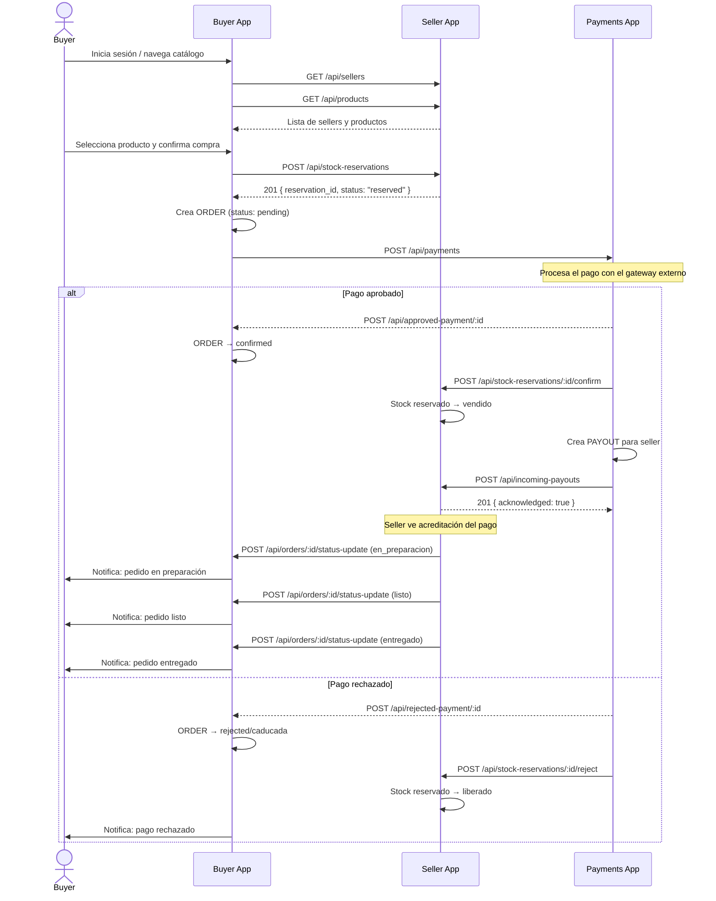

# 1.1 — Descripción del Sistema

> **Tipo C — Marketplace**

---

## ¿Qué problema resuelve?

+ Encontrar plantas específicas o accesorios de jardinería suele implicar visitar múltiples viveros físicos o buscar entre grupos informales de redes sociales, donde no existe garantía sobre la disponibilidad real de productos, la seguridad en los pagos ni un seguimiento claro de las compras realizadas.

+ **Brotes** centraliza la compra y venta de plantas y productos de jardinería en una plataforma digital confiable, permitiendo conectar compradores con vendedores dentro de un ecosistema seguro. El sistema facilita la publicación de productos, la gestión de compras y el procesamiento de pagos, brindando trazabilidad sobre cada operación comercial.

---

## Actores del sistema
| Actor                         | Descripción                                                                                                                                                                | Apps donde interactúa      |
| ----------------------------- | -------------------------------------------------------------------------------------------------------------------------------------------------------------------------- | -------------------------- |
| **Comprador**                 | Usuario que explora el catálogo, agrega productos al carrito y realiza compras. Puede ser una persona particular o un negocio.                                             | Buyer App, Payments App    |
| **Vendedor**                  | Usuario que publica productos (plantas, semillas, macetas, sustratos, etc.), gestiona su catálogo y administra los pedidos recibidos. Puede ser un particular o un vivero. | Seller App, Payments App|
| **Administrador del Sistema** | Gestiona el sistema globalmente: puede supervisar transacciones, resolver conflictos específicos, moderar contenido y consultar métricas.                                  | Control Plane (app global), Payments App|

---
## Flujo con clerk
se comparten users de clerk
login propio a cada app
clerk para cada situacion que involucre algún cambio en DB

---
## Flujo de venta
0. Log del user (Seller)
  a. clerk autentica Seller
1. Publica producto (nombre, descripción, fotos, precio, stock disponible) 
2. Recibe un pedido
3. Prepara pedido
4. Entrega Pedido
5. Acreditación del Pago
## Flujo de Compra

0. Log del user (Buyer)
  a. clerk autentica Seller
1. Agrega producto al carrito
2. Paga
3. Recibe producto

1. \[Vendedor]   Publica un producto en la Seller App (nombre, descripción, fotos, precio, stock disponible).
    a. clerk autentica que el seller se encuentre en DB
2. \[Comprador]  Explora el catálogo en la Buyer App, encuentra el producto y lo agrega al carrito.
3. \[Comprador]  Confirma la compra. La Buyer App solicita a la Payments App que procese el cobro.
4. \[Payments]   Valida y registra la transacción.
5. \[Buyer App]  Notifica a la Seller App que hay un nuevo pedido.
6. \[Vendedor]   Confirma el pedido en la Seller App y prepara el paquete.
7. \[Vendedor]   Actualzia el estado del pedido.
8. \[Comprador]  Consulta en la Buyer App el estado actualizado de su pedido.
9. \[Payments]   Registra la acreditación correspondiente al vendedor y mantiene el historial financiero de la operación.
---
## Flujo principal de uso
1. \[Vendedor]   Publica un producto en la Seller App (nombre, descripción, fotos, precio, stock disponible).
2. \[Comprador]  Explora el catálogo en la Buyer App, encuentra el producto y lo agrega al carrito.
3. \[Comprador]  Confirma la compra. La Buyer App solicita a la Payments App que procese el cobro.
4. \[Payments]   Valida y registra la transacción.
5. \[Buyer App]  Notifica a la Seller App que hay un nuevo pedido.
6. \[Vendedor]   Confirma el pedido en la Seller App y prepara el paquete.
7. \[Vendedor]   Actualzia el estado del pedido.
8. \[Comprador]  Consulta en la Buyer App el estado actualizado de su pedido.
9. \[Payments]   Registra la acreditación correspondiente al vendedor y mantiene el historial financiero de la operación.
---

---

## Alcance funcional por aplicación
| App              | Funcionalidades principales|
| ---------------- | ------------------------------------------------------------------------------------------------------------------------------------------------------ |
| **Buyer App**| Explorar catálogo, buscar productos, gestionar carrito, registrar pedidos y consultar estado de compras.|
| **Seller App**| Publicar productos, administrar stock, recibir pedidos y actualizar estado de venta.|
| **Payments App** | Procesar pagos, registrar transacciones, acreditar pagos a vendedores y mantener historial de transacciones.|
