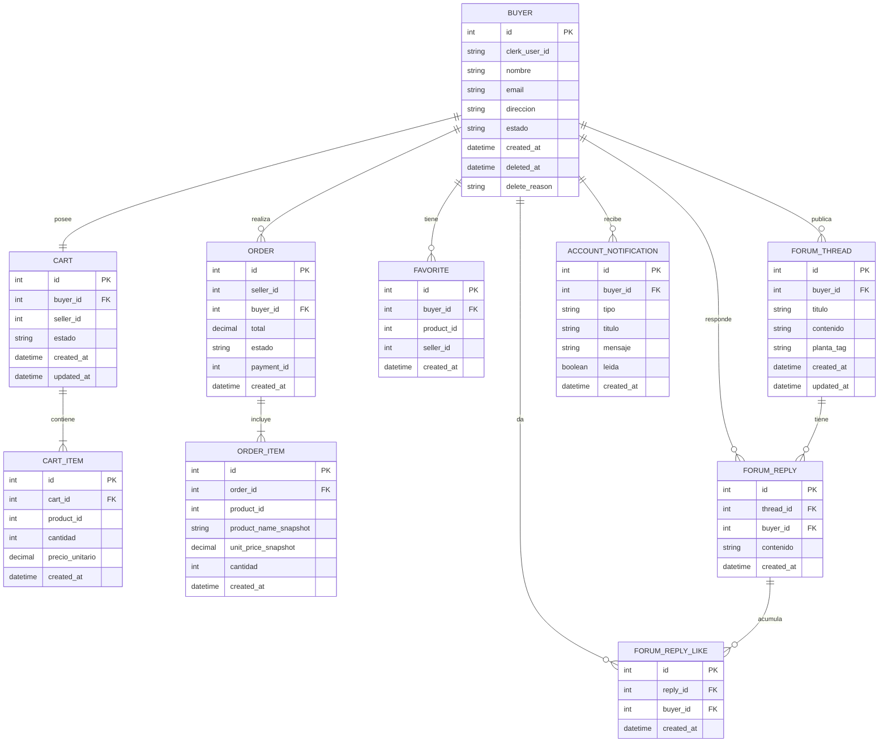
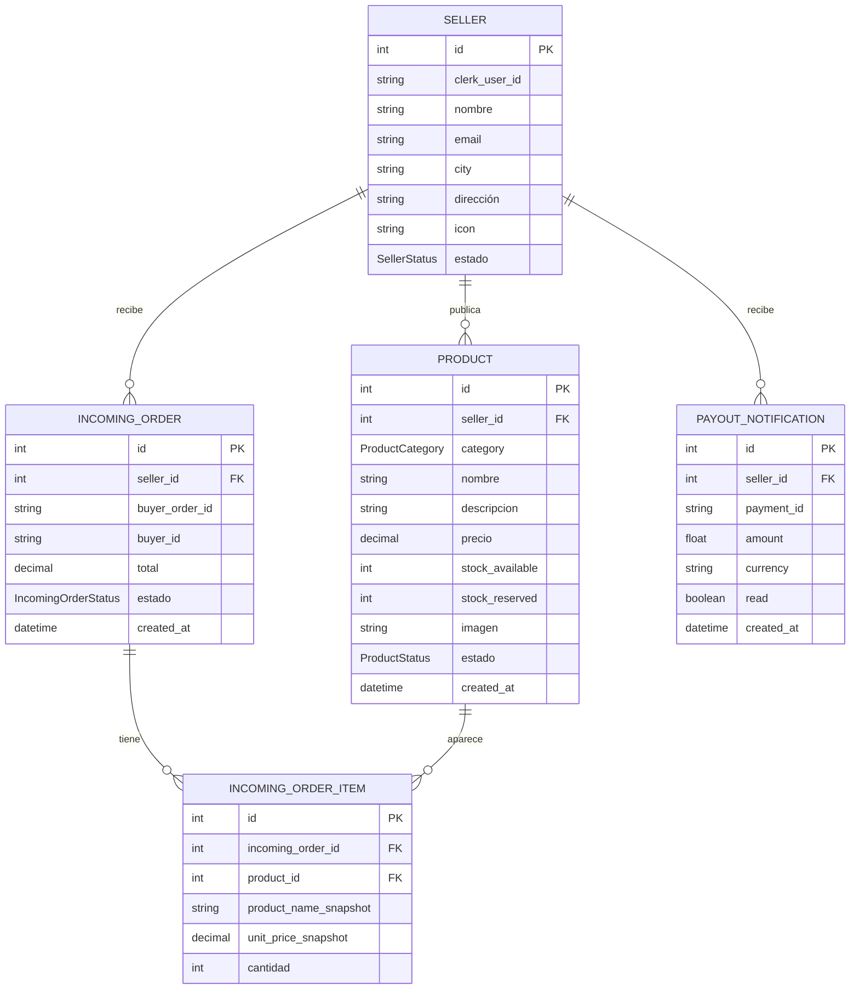
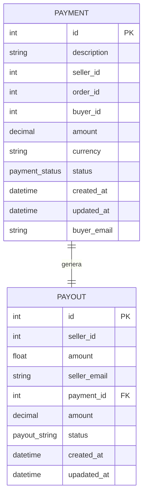

# 1.4 — Modelo de Datos por Aplicación

> **Tipo C — Marketplace**
---
## Decisión de diseño — alcance del marketplace

Para este proyecto, una ORDER pertenece a un único SELLER.

Implicancias:
- ORDER incluye un campo seller_id
- Todos los ORDER_ITEM pertenecen a ese mismo seller
- Buyer App envía una única orden a Seller App
- No se contempla el escenario multi-vendedor
---
 
 + `ORDER.payment_id` debe ser `null` en un principio ya que la orden se crea en estado `pending` hasta que se registre el pago procesado en *Payments App*
 + *Buyer* → reserva → → *Seller* crea `INCOMING_ORDER` como `pending` 
 + Si `PAYMENT.status` cambia a `approved`, *Buyer App* actualiza `ORDER.status`=`confirmed` 
 +  Si `PAYMENT.status` cambia a `approved`, *Seller App* cambia estado de `INCOMING_ORDER` a `confirmed`
---

## Buyer App

### Entidades principales

- `ORDER.seller_id` es FK a Seller App (refleja un solo vendedor por compra)
- `CART.buyer_id` es FK a `BUYER.id`
- `ORDER.buyer_id` es FK a `BUYER.id`
- `CART_ITEM.cart_id` es FK a `CART.id`
- `CART_ITEM.product_id`: referencia externa a Seller App
- `ORDER_ITEM.order_id` es FK a `ORDER.id`
  
---

## Seller App

### Entidades principales

- `PRODUCT.seller_id` es FK a `SELLER.id`
- `INCOMING_ORDER.seller_id` es FK a `SELLER.id`
- `INCOMING_ORDER.buyer_order_id`: referencia externa a Buyer App
- `INCOMING_ORDER_ITEM.incoming_order_id` es FK a `INCOMING_ORDER.id`
- `INCOMING_ORDER_ITEM.product_id` es FK a `PRODUCT.id`
- `PAYOUT_NOTIFICATION.seller_id` es FK a `SELLER.id`
  
---

## Payments App

### Entidades principales

- `PAYOUT.payment_id` es FK a `PAYMENT.id`
- `PAYMENT.order_id`: referencia externa a Buyer App
- `PAYMENT.seller_id` y `PAYMENT.seller_id` : referencia externa a Seller App
---

### Enum: ProductCategory
Valores posibles para `PRODUCT.category`:
- suculentas
- plantas_de_interior
- aromaticas
- frutales
- cactus
- colecciones_raras
- macetas_y_kits

## Definición de estados

### `INCOMING_ORDER.status`
`{ pendiente, recibida, en_preparacion, listo, entregada}`
> `Seller` marca orden como entregada → `POST`→ `Buyer App`
### `ORDER.status`
`{pendiente, caducada, confirmada, en_preparacion, listo, entregada}`
> una vez que `Payments App` apruebe el pago se cambia a confirmada: `POST`

### `CART.status`
`{active, checked_out, abandoned}`

### `PRODUCT.status`
`{active, inactive}`

### `PAYMENT.status`
`{pending, approved, rejected}`

### `PAYOUT.status`
`{pending, paid}`

---

## Datos duplicados y estrategia de consistencia

| Dato duplicado | Apps que lo tienen | Fuente de verdad | Estrategia |
|----------------|--------------------|-----------------|------------|
| Usuario (clerk_user_id) | Todas | Clerk | Cada app sincroniza al primer login vía webhook o lazy load |
| Producto (product_id, nombre, precio) |Seller App, Buyer App |Seller App |Buyer App consulta el producto vía API y guarda un snapshot del nombre y precio al confirmar la compra para preservar historial |
|Orden (order_id, estado)|Todas|Buyer App|Buyer App genera la orden y notifica a Seller App y Payments App vía API. Cada app mantiene una copia local del estado asociado|
|Estado de pago (payment_id, estado)|Buyer App, Payments App|Payments App|Payments App expone el estado vía API y Buyer App consulta o sincroniza actualizaciones para mostrar el estado al comprador|
|Datos del vendedor (seller_id)|Seller App, Payments App|Seller App|Payments App recibe el seller_id al registrar el pago y lo usa para generar acreditaciones, sin replicar más información del vendedor|
